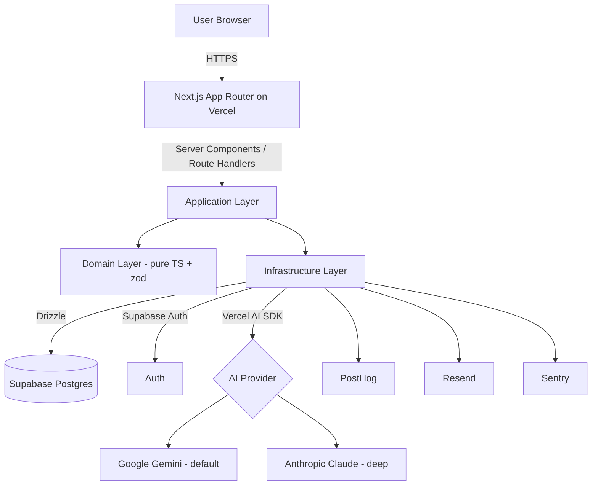

# PRD — Rancang Ide

_Technical blueprint for the coding agent. Read `docs/product-vision.md` first. Visual design tokens live in `docs/design.md` (run the Design System skill before implementing UI)._

---

## 1. Overview

- **Product name:** Rancang Ide
- **One-liner:** A web app that turns raw ideas into product blueprints — validated first, then generated into a PRD and task breakdown ready for an AI coding agent.
- **Objective:** Force the validation + spec stage before execution, so solo builders stop building products nobody needs and the handoff to an AI coding agent becomes directed.
- **Differentiation:** Validation-first (not generation-first), per-project persistence, export optimized for AI coding agents, local Indo/English context.
- **Magic moment:** A 2-sentence idea → ±2 minutes → an honest validation report (verdict + fatal flaws) + an editable draft feature tree.
- **Success criteria (MVP):** The founder completes 3 full pipelines without defecting to direct chat; ≥3 of 5 external testers return for a 2nd project; AI cost per project below the guardrail target.

---

## 2. Technical Architecture

**Architecture overview**



**Stack table**

| Layer | Choice | Notes |
|---|---|---|
| Framework | Next.js (App Router), TypeScript strict | Server Components + Route Handlers; deploy Vercel |
| Styling | Tailwind CSS + design tokens from `docs/design.md` | Neo-brutalism-lite; tokens as CSS vars |
| Backend | Next.js Route Handlers (serverless) | All AI calls server-side |
| ORM | Drizzle | Migrations in the repo, not the dashboard |
| Database | Supabase Postgres | RLS enabled |
| Auth | Supabase Auth | Email + Google OAuth |
| AI | Vercel AI SDK | `streamObject` for structured output via zod; provider switch Gemini/Claude |
| Validation | zod | Shared schemas; single source of truth |
| Analytics | PostHog | Activation & retention funnel |
| Email | Resend | Verification, notifications |
| Error tracking | Sentry | Client + server |
| Payments | None (phase 1) | Paywall stub; gateway in phase 2 |

**Integration guide**
- **AI:** calls only from Route Handlers. Use the Vercel AI SDK with a provider abstraction; default `google('gemini-2.x-flash')` for drafts/tree, `anthropic('claude-...')` option for "deep" validation. All generation output validated via a zod schema from `packages`/`src/shared`. Stream to the client via AI SDK streaming.
- **Supabase:** SSR client for the auth session in Server Components; service layer in infrastructure. Enable RLS; users access only their own rows.
- **Secrets:** all keys (Supabase service role, Gemini, Anthropic, Resend, Sentry DSN, PostHog key) in Vercel env. Complete `.env.example`. Never expose the service role / AI keys to the client.

**Repo structure (layered + feature-driven)**

```
src/
  app/                      # Next.js App Router (presentation entry)
    (auth)/                 # login, callback
    (app)/                  # authenticated area
      projects/
      projects/[id]/
    api/                    # Route Handlers
      validate/route.ts
      structure/route.ts
      prd/route.ts
      tasks/route.ts
  features/
    validation/
      presentation/         # components, screens
      application/          # use-cases, hooks
      domain/               # entities, zod schemas, pure logic
      infrastructure/       # AI calls, repo access
    structure/
      { presentation, application, domain, infrastructure }
    prd/
      { presentation, application, domain, infrastructure }
    tasks/
      { presentation, application, domain, infrastructure }
    projects/
      { presentation, application, domain, infrastructure }
    auth/
      { presentation, application, domain, infrastructure }
  shared/
    domain/                 # cross-cutting entities, zod schemas
    ui/                     # design-system primitives (Button, Card, ...)
    infrastructure/         # supabase client, ai client factory, db (drizzle)
    lib/                    # utils
  styles/                   # tokens.css, globals.css
drizzle/                    # migrations + schema
```

**Dependency rule:** presentation → application → domain ← infrastructure. Domain = pure TS, zero framework/IO imports. Inner layers never import outer layers. AI/DB/Supabase only in infrastructure.

**Infrastructure**
Vercel (hosting + serverless + env). Supabase (Postgres + Auth). External AI provider. CI: GitHub Actions (lint, typecheck, test) on every PR.

**Security**
RLS on all user-owned tables. AI & DB keys server-only. Rate limit the generation endpoints per user (prevent abuse & control cost). Sanitize/escape markdown on render (prevent XSS from AI output). Don't store user API keys (BYOK later).

**Cost estimate (rough, MVP)**
Vercel Hobby/Pro + Supabase Free/Pro ≈ $0–45/mo. AI variable: one full pipeline (deep validation + tree + PRD + tasks) estimated at hundreds of thousands of tokens; **must be measured for real at implementation** and become the basis for the free quota (initial assumption: 3 free projects). Gemini Flash is chosen as the default precisely to keep this number down.

---

## 3. Data Model

**Entities**

`profiles` (extends Supabase `auth.users`)
- `id` uuid PK = auth user id
- `email` text
- `display_name` text null
- `plan` text enum('free','pro') default 'free'
- `created_at` timestamptz default now()

`projects`
- `id` uuid PK default gen_random_uuid()
- `user_id` uuid FK → profiles.id (cascade)
- `title` text
- `idea_input` text                      # the user's raw idea
- `context` jsonb null                    # target user, optional notes
- `status` text enum('draft','validated','structured','spec_ready') default 'draft'
- `created_at`, `updated_at` timestamptz

`validations`
- `id` uuid PK
- `project_id` uuid FK → projects.id (cascade)
- `verdict` text enum('strong','weak','pivot')
- `report` jsonb                          # {core_assumption, fatal_flaws[], competition, scorecard{}}
- `model_used` text
- `created_at` timestamptz

`documents`
- `id` uuid PK
- `project_id` uuid FK → projects.id (cascade)
- `type` text enum('tree','prd','tasks')
- `content` jsonb                         # tree: nodes[]; prd: markdown+meta; tasks: task[]
- `version` int default 1
- `model_used` text
- `created_at`, `updated_at` timestamptz

`generations` (usage tracking / cost & quota)
- `id` uuid PK
- `user_id` uuid FK → profiles.id
- `project_id` uuid FK → projects.id null
- `stage` text enum('validation','structure','prd','tasks')
- `model` text
- `input_tokens` int null
- `output_tokens` int null
- `created_at` timestamptz

**Relationships**
profiles 1—N projects; projects 1—N validations; projects 1—N documents; profiles 1—N generations. The free quota is computed from active `projects` per user (default limit 3).

**RLS:** every user-owned table is filtered `user_id = auth.uid()` (via a project join for child tables).

---

## 4. API Specification

All endpoints = Next.js Route Handlers, auth required (Supabase session), streaming where relevant.

| Method | Path | Body | Response | Auth |
|---|---|---|---|---|
| POST | `/api/projects` | `{title, idea_input, context?}` | `{project}` | yes |
| GET | `/api/projects` | — | `{projects[]}` | yes |
| GET | `/api/projects/:id` | — | `{project, validation?, documents[]}` | yes |
| DELETE | `/api/projects/:id` | — | `{ok}` | yes |
| POST | `/api/validate` | `{project_id, model?}` | stream → `{validation}` | yes, quota-checked |
| POST | `/api/structure` | `{project_id, model?}` | stream → `{tree}` | yes, quota-checked |
| POST | `/api/prd` | `{project_id, tree}` | stream → `{document:prd}` | yes, quota-checked |
| POST | `/api/tasks` | `{project_id}` | stream → `{document:tasks}` | yes, quota-checked |
| PATCH | `/api/documents/:id` | `{content}` | `{document}` | yes |

**Contract rules:** every generation endpoint validates the AI output with a zod schema before persisting. The quota check happens before calling the AI; if `plan=free` and active projects ≥ limit → a 402-style `{error:'quota_exceeded'}`. Every generation writes one `generations` row.

---

## 5. User Stories

- **US-1 (Rafi):** As a solo dev, I want to write a short idea and immediately get a worth-it-or-not verdict, so I don't waste time on weak ideas.
  _AC:_ input ≥1 sentence → within ≤3s starts streaming → verdict + ≥3 fatal flaws + scorecard shown → saved to the project.
- **US-2:** As a user, I want to edit the AI's feature tree, so the blueprint matches my intent.
  _AC:_ can rename, add, delete nodes; tag phase (MVP/v2/later); changes saved.
- **US-3:** As a user, I want to generate a PRD from the curated tree, so I have a ready-to-use spec.
  _AC:_ PRD markdown includes overview, features + acceptance criteria, non-goals; lightly editable.
- **US-4:** As a user, I want to break the PRD into checkbox tasks, so my AI coding agent has a work order.
  _AC:_ ordered task list, each task has a description + checkbox.
- **US-5:** As a user, I want to export markdown / copy a Claude Code prompt, so the handoff is instant.
  _AC:_ copy & download buttons produce valid markdown.
- **US-6:** As a user, I want all projects saved, so I can continue anytime.
  _AC:_ history shows all projects with status; click → open fully.
- **US-7:** As a free user, I want to know the quota limit, so I understand when to upgrade.
  _AC:_ upon reaching 3 active projects, attempting a new project shows a paywall stub.

---

## 6. Functional Requirements

- **FR-001 (P0):** Auth email + Google via Supabase. AC: sign up, login, logout, protected routes redirect to login.
- **FR-002 (P0):** Project CRUD + history list. AC: create/read/delete; list ordered by `updated_at` desc.
- **FR-003 (P0):** Validation generator (streaming) → verdict/flaws/competition/scorecard, persist to `validations`. AC: output passes the zod schema; verdict ∈ {strong,weak,pivot}.
- **FR-004 (P0):** Feature tree generator + editor (collapsible). AC: nodes can rename/add/delete + phase tag; persist to `documents(type=tree)`.
- **FR-005 (P0):** PRD generator from the tree. AC: structured markdown; persist to `documents(type=prd)`.
- **FR-006 (P1):** Task breakdown generator. AC: checkbox task list; persist to `documents(type=tasks)`.
- **FR-007 (P0):** Export markdown + copy-to-clipboard (including "prompt for Claude Code"). AC: valid markdown, copied.
- **FR-008 (P0):** Free quota stub (3 active projects). AC: creating the 4th → paywall stub, no charge.
- **FR-009 (P1):** Per-stage model selection (default economy, deep option). AC: choice saved; `model_used` recorded.
- **FR-010 (P1):** Optional clarifying questions in the validation stage. AC: the user's answers enrich the regenerate prompt.
- **FR-011 (P2):** Per-section regenerate. AC: regenerate one document without deleting others.

---

## 7. Non-Functional Requirements

- **Performance:** streaming validation starts < 3s; main-page TTI < 2.5s on a 4G connection.
- **Cost:** average AI cost per full pipeline ≤ guardrail target (set at implementation; the free quota derives from this).
- **Security:** RLS enabled; AI/DB keys server-only; generation rate limit (e.g. ≤ N/min/user); markdown output sanitized on render.
- **Accessibility:** WCAG AA; text contrast on cobalt `#1B44F0` meets the ratio; clear keyboard focus (the neo-brutalist border helps).
- **Scalability:** stateless serverless; DB indexed on `user_id`, `project_id`.
- **Reliability:** AI failures show an error state + retry; never persist half-finished invalid output.

---

## 8. UI/UX Requirements

Design tokens (cobalt `#1B44F0` monochrome, fonts Clash Display/Inter/JetBrains Mono, neo-brutalism-lite) live in `docs/design.md` — don't duplicate them here; if it doesn't exist yet, run the Design System skill first.

**Screens & states** (each screen: empty / loading / error / populated)
1. **Auth** — login (email + Google). States: idle, submitting, error.
2. **Dashboard / History** — project list. Empty: CTA "Create your first project".
3. **New Project / Idea Input** — idea textarea + optional context field + model selection.
4. **Validation View** — streaming report: verdict badge (semantic colors used sparingly), fatal flaws (list), competition, scorecard. Loading: streaming skeleton. Error: retry.
5. **Structure / Tree View** — collapsible tree, editable nodes, phase badges. (NOT a free canvas; react-flow canvas = phase 2.)
6. **PRD View** — markdown viewer + light editor; regenerate & export buttons.
7. **Tasks View** — checklist; export/copy buttons.
8. **Paywall stub** — appears when the free quota is exhausted; upgrade CTA (no payment yet).

**Interactions:** all generation streams with a progress indicator; destructive actions (delete project) confirm; copy gives "Copied" feedback.

---

## 9. Auth Implementation (Supabase)

- Supabase Auth, providers: email (magic link or password — choose magic link for simplicity) + Google OAuth.
- SSR: use `@supabase/ssr` to read the session in Server Components & Route Handlers.
- Create a `profiles` row on first login (DB trigger or upsert in the callback).
- Protected routes in the `(app)` group; unauth → redirect `/login`.
- RLS policy: `auth.uid() = user_id`.

---

## 10. Payment Integration

Phase 1: **none.** Freemium is enforced via a quota stub (count active `projects`; limit 3 for `plan=free`). The paywall is UI + CTA only, no charge.
Phase 2 (out of scope now): integrate Lemon Squeezy/Polar (global) or Midtrans/Xendit (local); update `profiles.plan` via webhook. Noted as an Open Question.

---

## 11. Edge Cases & Error Handling

- Empty/too-short idea input → form validation, block submit.
- AI returns schema-non-conforming output → reject, show error, don't persist; provide retry.
- Streaming interrupted → show partial + a regenerate button; don't save invalid partials.
- Quota exhausted → paywall stub, not a raw error.
- Rate limit reached → "try again shortly" message.
- AI provider down → fallback message + suggest switching model (Gemini↔Claude).
- Project not found / not owned by the user → 404, don't leak the row's existence.

---

## 12. Dependencies & Integrations

Next.js, TypeScript, Tailwind CSS, Drizzle ORM, `@supabase/supabase-js` + `@supabase/ssr`, Vercel AI SDK (`ai`, `@ai-sdk/google`, `@ai-sdk/anthropic`), zod, PostHog JS, Resend, Sentry (`@sentry/nextjs`). Fonts: Clash Display (self-host), Inter, JetBrains Mono. (Versions: the coding agent installs the latest compatible versions at build time.)

---

## 13. Out of Scope

Full BRD, team/collab, react-flow free-form canvas, active payment gateway, template marketplace, multi-language toggle, mobile app, user-facing analytics dashboard, Notion/Linear/GitHub integration, complex document versioning, BYOK API key.

---

## 14. Open Questions

1. Final Pro price (direction IDR 49–79k/mo or ~$5 parity) — phase 2.
2. Payment vendor (Lemon Squeezy/Polar vs. Midtrans/Xendit) — phase 2.
3. Magic link vs. email+password for auth — default magic link, confirm at build.
4. Exact default model (Gemini Flash version) & "deep" model (Claude) — pick the latest compatible version at implementation, measure cost.
5. Final free quota number — 3 projects as the initial assumption; calibrate from real cost.
